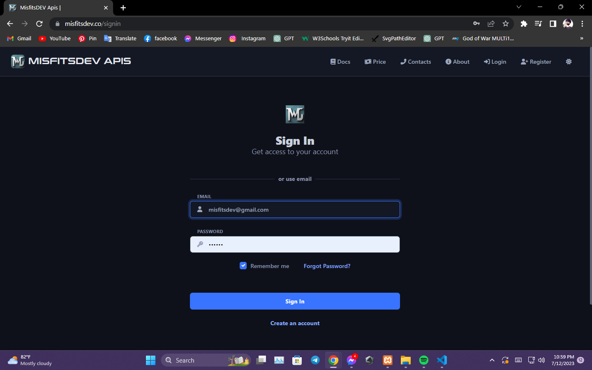
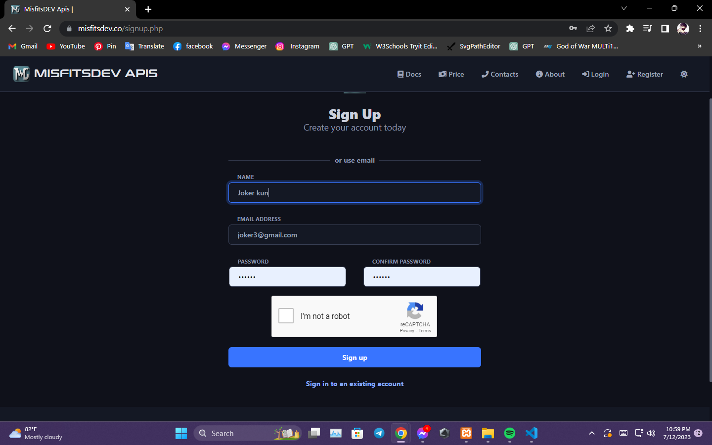
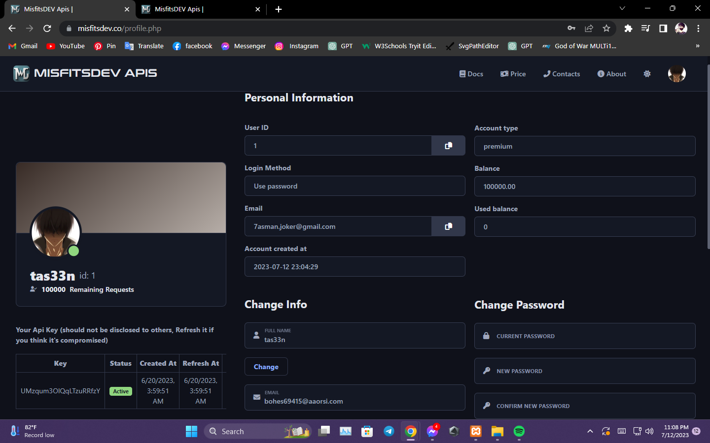
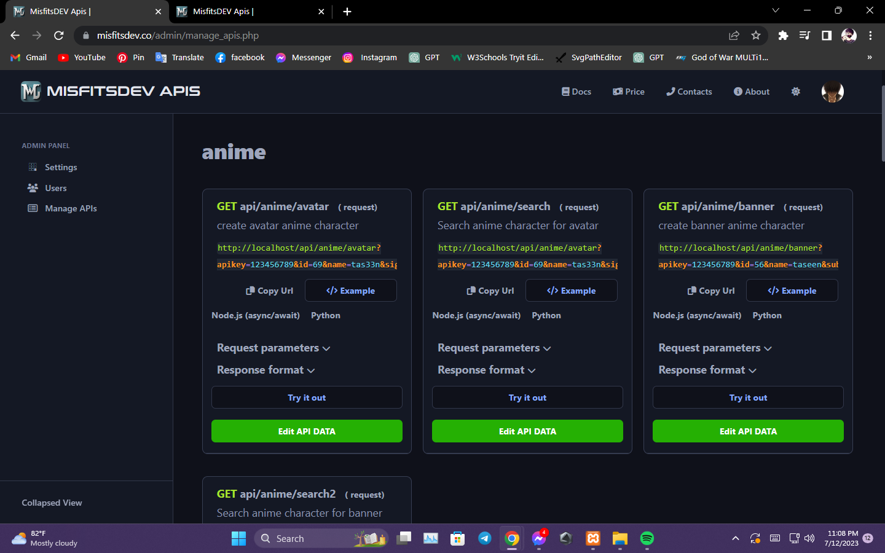
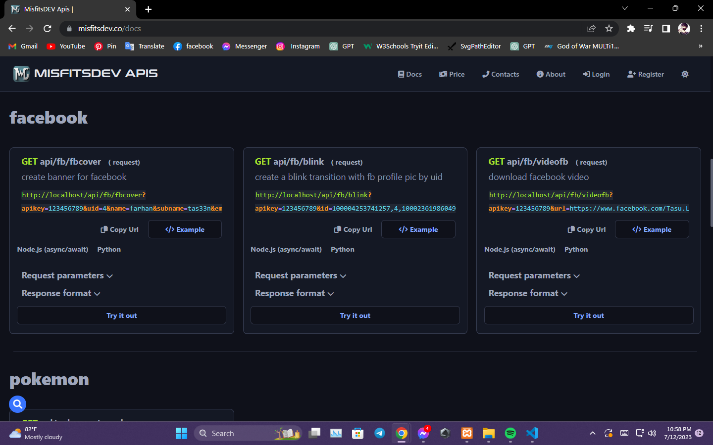

# MISFITDEV APIs

A PHP-based API management website for developers.
 
(Private Source)

  

  

  

  

## About

This repository contains the code for an API documentation website where anyone can signup and get a key for their project to use our various anime API, social media downloader, Facebook banner API, live score API, and many more.

## Features

• **Sign up and get a key**: Anyone can signup for a free account and get a key to use our APIs.

• **Various APIs** : We offer a variety of APIs, including anime API, social media downloader, Facebook banner API, live score API, and many more.

• **Simple Doc**: Our documentation is simple and easy to understand, so you can get started using our APIs quickly.

• **Live Demo**: We have a live demo of our APIs so you can see how they work before you start using them in your project.

## Usage

To use our APIs, you will need to get a key from the website. Once you have a key, you can use it to make requests to the APIs. The documentation will show you how to make requests to each API.

1. Sign up or log in with existing credentials.
2. You'll get an API key for your project.
3. Explore the API documentation to understand how to use different APIs.
4. Integrate the API key into your project and start making requests to the desired APIs.

## Contributing

We welcome contributions to this repository. If you find any bugs or have any suggestions, please open an issue or Contact with us.

## Contact

If you have any questions, suggestions, or concerns, feel free to contact us through the following channels:

- Email: admin@misfitsdev.co
- Website: [misfitsDev](https://misfitsdev.co)
- Telegram: [MisfitsDEV](https://t.me/misfitsdev)

## License

This project is licensed under the [MIT License](https://opensource.org/licenses/MIT). See the `LICENSE` file for more details.
